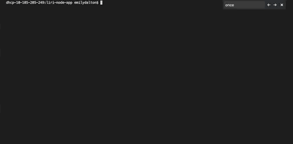
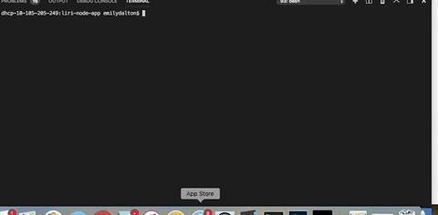

# liri-node-app

LIRI (Language Intrepretation and Recognition Interface) is a command line node app that takes in parameters and returns data to the user. 

## How it works:
 

LIRI uses three REST APIs to answer user questions about live music performances, information about specific songs, and information about specific films. 

This app uses Axios to make http requests from node.js to the Bands in Town API, the Spotify API, and and the OMDB API. 

After a user enters in one of three prompts, a switch statement is exectuted calling one of four functions that makes the API request.
### concert-this
If the user types in the command "concert-this" followed by the name of the performer they get the following information: 

* The name of the performer
* The name of the venue
* The location of the venue
* The date of the event (formatted as MM/DD/YYYY)

### spotify-this-song
If the user types the command "spotify-this-song" followed by the name of a song they get the following information: 

* Name of the artits
* Name of the song
* Preiew Link from Spotify
* The album that the song is from 

### default search for spotify-this-song
If the user does not specify a song using the command "spotify-this-song" LIRI will return results for the song "All I Want for Christmas" by Mariah Carey.

### movie-this
If the user types the command "movie-this" followed by the name of a film they get the following information: 

* Movie title 
* Year the movie was released
* Movie's Rotten Tomatoes rating
* Country where the movie was produced: 
* Language of the movie 
* Plot synopsis 
* Actors in the movie 

### movie-this default search
If the user does not specify a song using the command "movie-this" LIRI will return results for the film "Mr. Nobody."

Using node, LIRI also reads commands from a text file: 

### do-what-it-says
In the following example LIRI is reading the command "spotify-this-song I want it that way":

### do-what-it-says (different command) 

If the commands within the file are changed, the program will return results specific to that command. In this case, "movie-this ghostbusters" 

Additionally, all of the users commands are logged to a file called "log.txt." This is logged at the top of the results for every query. 

## API Documentation: 

* [Bands in Town](https://app.swaggerhub.com/api/Bandsintown/PublicAPI/3.0.0)
* [Spotify](https://developer.spotify.com/documentation/) 
* [OMDB](http://www.omdbapi.com/)

 

