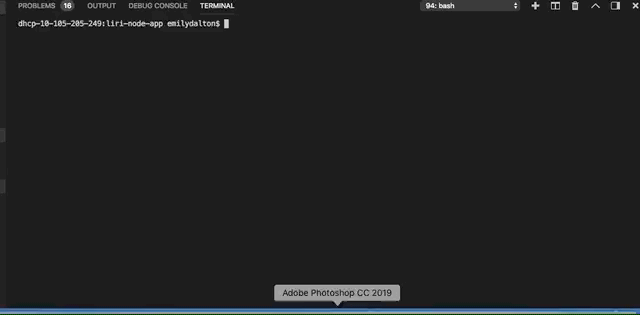

# liri-node-app

LIRI (Language Intrepretation and Recognition Interface) is a command line node app that takes in parameters and returns data to the user. 

## How it works:
 

LIRI uses three REST APIs to answer user questions about live music performances, information about specific songs, and information about specific films. 

This app uses Axios to make http requests from node.js to the Bands in Town API, the Spotify API, and and the OMDB API. 

After a user enters in one of three prompts, a switch statement is exectuted to call one of three functions that calls the spefified API and which responds with the information. 

### concert-this

### spotify-this-song

### default search for spotify-this-song

### movie-this

### movie-this default search

Using node, Liri also reads commands from a text file: 

### do-what-it-says

### do-what-it-says (differnt command) 

if the commnands within the file are changed, the program will return results specific to that command. 

 

